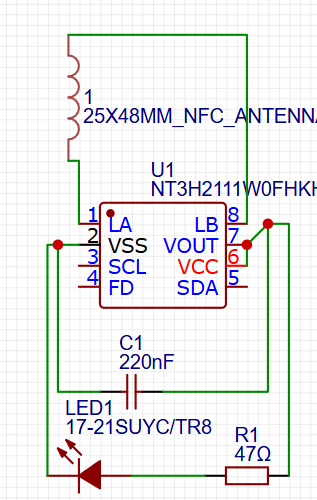
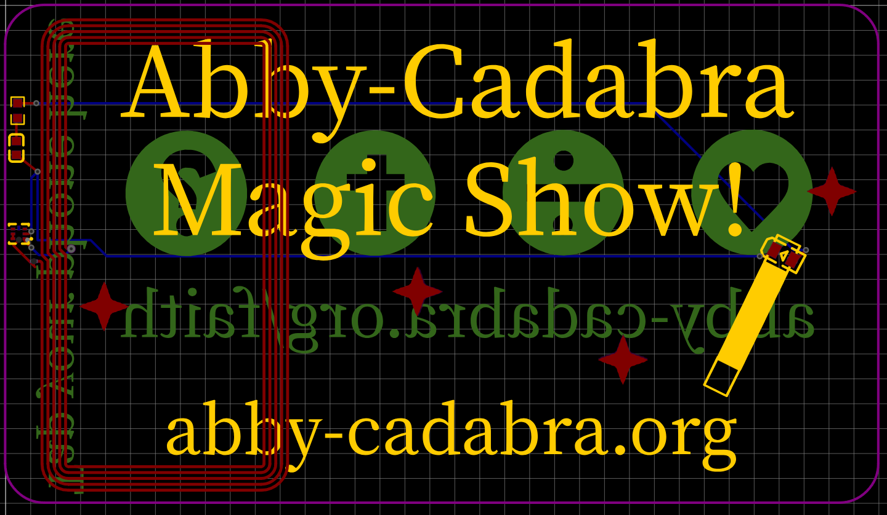
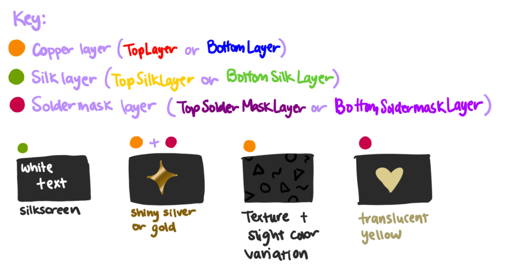
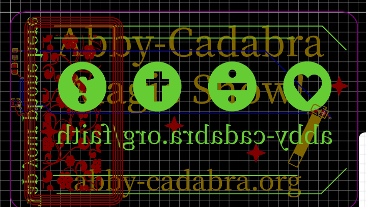

# August 19: Made the schematic

I started by struggling to find a tutorial I could understand, because I was trying to use the jams.hackclub.com/jam/hacker-card tutorial with KiCad (because I already had it installed and that's what the Hackpad tutorial used), but I couldn't find any of the components to add to the schematic.

I ended up just making an account for EasyEDA (what the hacker card tutorial used) and got confused again because EasyEDA got updated and the tutorial was out of date. Instead of using the pro version (which is free) on EasyEDA, you have to choose the older version and the tutorial makes perfect sense.

After I got that figured out, the tutorial was very well written and it was easy to follow along what was going on.

Time: I don't know for sure, but probably 1 hour is a safe guess including time finding the tutorial.

# August 19: Made the PCB

Yes, this is the same day, but I'm kind of breaking this up like you would with devlogs in Stardance to make it easier to read.

The tutorial was still well written for creating the PCB, and I was able to create it relatively easily.

A fun part was seeing all the different finishes the tutorial mentioned being able to put on the PCB, like silkscreen, silver/gold, texture, and translucent by changing what layers you place decorations on.

Time: I did track this with Lapse, so I know it was 47 minutes.

# Still August 19: Prepare GitHub repo and

I was checking the DRC before exporting the gerber files and had a bunch of errors related to the antenna, which is not something I designed. I asked about it in the Slack huddle for Speedrun, and found out that those errors were fine but I needed to move the chip outside of the antenna so that it will work at all. The tutorial didn't mention anything about that, so I didn't know I needed to do that.

I got that fixed by rewiring almost everything.

This is where the tutorial ends.

Then I started getting the gerbers ready and got started setting up the JLCPCB order in the cart. Then I needed a BOM and CPL file. I knew what a BOM was, but not a CPL. I hand wrote the files (there were only four components on the PCB) and JLCPCB rejected the CPL.

Then I discovered that EasyEDA can auto generate these files, and then they worked.

I submitted the form for Speedrun, but I forgot to commit and push the new files to GitHub.

Time: 22 minutes in the code editor writing the README and BOM/CPL, maybe an hour not in the code editor? I forgot to track it again.

# August 20: Feedback from the form

Several of the things I had to fix would have been fixed if I had remembered to commit and push the files to GitHub, but I forgot to do that. I also needed to create this file, add EasyEDA source files (which I didn't know you could export), and "make the PCB art nicer."

Time: 50 min writing this (hackatime tracked) and probably around 45 minutes in EasyEDA editing the PCB art, and 15 minutes reexporting the files and getting the JLCPCB cart set up to make sure the price is the same.

