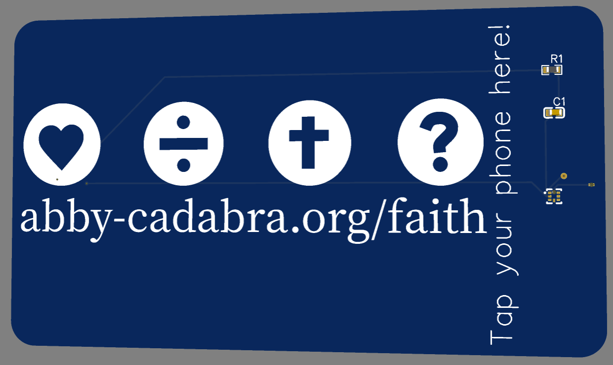

# Magic Card
 This is a PCB business card! Tap your phone, and my website will open on your phone.

# Challenges

This is only the second PCB I have ever made, and the tutorial I followed used a different software than I used for the first one.

Trying to figure that out was challenging, but I ended up using the other software and the guide was really well written after I realized I needed to use the older version of the software.

# Features
- LED on the tip of a magic wand that lights up when scanned
- Shiny sparkles that are not the standard white silkscreen
- All components on the back other than the LED for looks

# Credits

[Tutorial](https://jams.hackclub.com/jam/hacker-card)

Thanks to everyone on the Hack Club Speedrun huddle chat who helped me understand the tutorial and get this project made!
